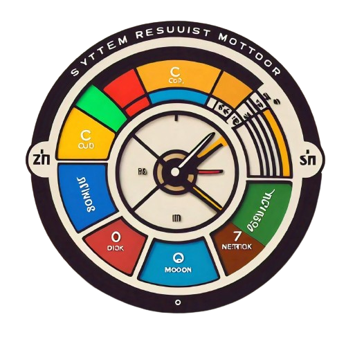
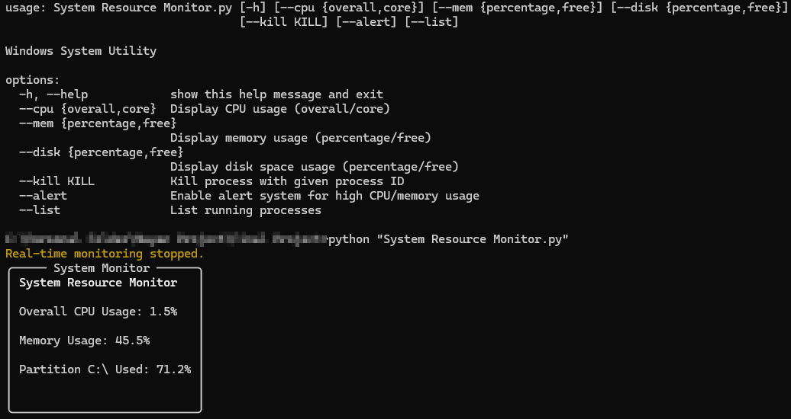

<a id="readme-top"></a>

<!-- PROJECT LOGO -->

<div align="center">
<a href="https://github.com/nay1611/System-Resource-Monitor">

</a>
<h3 align="center">System Resource Monitor</h3>
<p align="center">
A Windows system utility to monitor CPU usage, memory usage, disk space usage, and manage running processes.
<br />
<a href="https://github.com/nay1611/System-Resource-Monitor"><strong>Explore the docs »</strong></a>
</p>
</div>

<!-- TABLE OF CONTENTS -->
<details>
<summary>Table of Contents</summary>
<ol>
  <li>
    <a href="#features">Features</a>
  </li>
  <li>
    <a href="#prerequisites">Prerequisites</a>
  </li>
  <li>
    <a href="#usage">Usage</a>
    <ul>
      <li><a href="#command-line-arguments">Command-Line Arguments</a></li>
      <li><a href="#examples">Examples</a></li>
    </ul>
  </li>
  <li>
    <a href="#script-overview">Script Overview</a>
    <ul>
      <li><a href="#importing-required-libraries">Importing Required Libraries</a></li>
      <li><a href="#parsing-command-line-arguments">Parsing Command-Line Arguments</a></li>
      <li><a href="#functions-to-get-system-usage">Functions to Get System Usage</a></li>
      <li><a href="#function-to-list-processes">Function to List Processes</a></li>
      <li><a href="#function-to-kill-a-process">Function to Kill a Process</a></li>
      <li><a href="#logging-and-alert-system">Logging and Alert System</a></li>
      <li><a href="#main-function">Main Function</a></li>
    </ul>
  </li>
  <li><a href="#logging">Logging</a></li>
  <li><a href="#alert-system">Alert System</a></li>
  <li><a href="#conclusion">Conclusion</a></li>
</ol>
</details>


# Windows System Utility

This is a Windows system utility script designed to monitor and control system resources such as CPU, memory, and disk usage. The script can also list running processes, terminate processes, and provide real-time alerts for high CPU or memory usage.



## Features

- **CPU Usage Monitoring**: Display real-time CPU usage percentages (overall or per-core).
- **Memory Usage Monitoring**: Display real-time memory usage percentages or available memory in GB.
- **Disk Space Monitoring**: Display available disk space percentages or free storage in GB for each partition.
- **Process Management**: List running processes with their names and process IDs.
- **Process Termination**: Terminate a process by its process ID.
- **Alert System**: Real-time alerts for high CPU or memory usage.
- **Logging**: Log system events such as process termination and high resource usage.

## Prerequisites

- Python 3.6 or higher
- pip
- The following Python packages:
  - `psutil`
  - `rich`
  - `argparse`

You can install the required packages using:

```bash
pip install -r requirements.txt
```

## Usage

> **Note:** Please use the `v2` script for accurate functionality as the `v1` script displays all results regardless of the provided arguments.

### Command-Line Arguments

The script accepts the following command-line arguments:

- `--cpu`: Display CPU usage (`overall` or `core`). Default is `overall`.
- `--mem`: Display memory usage (`percentage` or `free`). Default is `percentage`.
- `--disk`: Display disk space usage (`percentage` or `free`). Default is `percentage`.
- `--kill <process-id>`: Kill process with the given process ID.
- `--alert`: Enable the alert system for high CPU/memory usage.
- `--list`: List running processes.

### Examples

1. **Display overall CPU usage and memory usage percentage**:
    ```bash
    python script.py --cpu overall --mem percentage
    ```

2. **Display per-core CPU usage and available memory in GB**:
    ```bash
    python script.py --cpu core --mem free
    ```

3. **Display disk space usage as a percentage for each partition**:
    ```bash
    python script.py --disk percentage
    ```

4. **Kill a process by its process ID**:
    ```bash
    python script.py --kill <process-id>
    ```

5. **Enable the alert system for high CPU/memory usage**:
    ```bash
    python script.py --alert
    ```

6. **List running processes**:
    ```bash
    python script.py --list
    ```

<p align="right">(<a href="#readme-top">back to top</a>)</p>

## Script Overview

### Importing Required Libraries

```python
import psutil
import argparse
import logging
import time
import threading
from rich.console import Console
from rich.table import Table
from rich.live import Live
from rich.panel import Panel
```

- `psutil`: Provides functions for accessing system details and hardware statistics.
- `argparse`: Used for parsing command-line arguments.
- `logging`: Used for logging events such as errors or alerts.
- `time`: Handles time-related tasks.
- `threading`: Used for running multiple tasks (threads) simultaneously.
- `rich`: Used for creating rich text and beautiful formatting in the console.

<p align="right">(<a href="#readme-top">back to top</a>)</p>

### Parsing Command-Line Arguments

```python
def parse_arguments():
    parser = argparse.ArgumentParser(description="Windows System Utility")
    parser.add_argument('--cpu', choices=['overall', 'core'], default='overall', help="Display CPU usage (overall/core)")
    parser.add_argument('--mem', choices=['percentage', 'free'], default='percentage', help="Display memory usage (percentage/free)")
    parser.add_argument('--disk', choices=['percentage', 'free'], default='percentage', help="Display disk space usage (percentage/free)")
    parser.add_argument('--kill', type=int, help="Kill process with given process ID")
    parser.add_argument('--alert', action='store_true', help="Enable alert system for high CPU/memory usage")
    parser.add_argument('--list', action='store_true', help="List running processes")
    return parser.parse_args()
```

- This function defines and parses the command-line arguments.

<p align="right">(<a href="#readme-top">back to top</a>)</p>

### Functions to Get System Usage

```python
def get_cpu_usage(option):
    if option == 'overall':
        return f"Overall CPU Usage: {psutil.cpu_percent(interval=1)}%"
    elif option == 'core':
        core_usage = psutil.cpu_percent(interval=1, percpu=True)
        return "\n".join([f"Core {i} CPU Usage: {percentage}%" for i, percentage in enumerate(core_usage)])

def get_memory_usage(option):
    mem = psutil.virtual_memory()
    if option == 'percentage':
        return f"Memory Usage: {mem.percent}%"
    elif option == 'free':
        return f"Memory Free: {mem.available / (1024 ** 3):.2f} GB"

def get_disk_usage(option):
    disk_usage = []
    for partition in psutil.disk_partitions():
        usage = psutil.disk_usage(partition.mountpoint)
        if option == 'percentage':
            disk_usage.append(f"Partition {partition.device} Used: {usage.percent}%")
        elif option == 'free':
            disk_usage.append(f"Partition {partition.device} Free: {usage.free / (1024 ** 3):.2f} GB / {usage.total / (1024 ** 3):.2f} GB")
    return "\n".join(disk_usage)
```

- `get_cpu_usage`: Returns the CPU usage either overall or per core.
- `get_memory_usage`: Returns the memory usage either as a percentage or free memory in GB.
- `get_disk_usage`: Returns the disk usage either as a percentage or free space in GB for each partition.

<p align="right">(<a href="#readme-top">back to top</a>)</p>

### Function to List Processes

```python
def list_processes():
    table = Table(title="Running Processes")
    table.add_column("PID", justify="right", style="cyan", no_wrap=True)
    table.add_column("Name", style="magenta")
    for proc in psutil.process_iter(['pid', 'name']):
        table.add_row(str(proc.info['pid']), proc.info['name'])
    console = Console()
    console.print(table)
```

- This function lists the running processes in a table format.

<p align="right">(<a href="#readme-top">back to top</a>)</p>

### Function to Kill a Process

```python
def kill_process(pid):
    try:
        p = psutil.Process(pid)
        p.terminate()
        print(f"Process {pid} terminated.")
    except Exception as e:
        print(f"Failed to terminate process {pid}: {e}")
```

- This function terminates a process given its process ID.

<p align="right">(<a href="#readme-top">back to top</a>)</p>

### Logging and Alert System

```python
logging.basicConfig(filename='system.log', level=logging.INFO, format='%(asctime)s - %(message)s')

def log_event(event):
    logging.info(event)

def alert_system():
    console = Console()
    while True:
        cpu = psutil.cpu_percent(interval=1)
        mem = psutil.virtual_memory().percent
        if cpu > 80:
            log_event(f"High CPU usage detected: {cpu}%")
            console.print(f"[red]Alert: High CPU usage detected: {cpu}%[/red]")
        if mem > 80:
            log_event(f"High memory usage detected: {mem}%")
            console.print(f"[red]Alert: High memory usage detected: {mem}%[/red]")
        time.sleep(5)
```

- Configures the logging system to write logs to a file named `system.log`.
- `log_event`: Logs the given event to the log file.
- `alert_system`: Continuously monitors CPU and memory usage and logs/prints alerts if usage exceeds 80%.

<p align="right">(<a href="#readme-top">back to top</a>)</p>

### Main Function

```python
def main():
    args = parse_arguments()
    console = Console()

    if args.kill:
        try:
            kill_process(args.kill)
            log_event(f"Process {args.kill} terminated")
        except Exception as e:
            console.print(f"[red]Error terminating process {args.kill}: {e}[/red]")

    elif args.alert:
        console.print("[yellow]Alert system enabled. Monitoring high CPU and memory usage.[/yellow]")
        alert_thread = threading.Thread(target=alert_system)
        alert_thread.start()

    elif args.list:
        list_processes()

    else:
        # Set default values if no specific flags are provided
        if not any([args.cpu, args.mem, args.disk]):
            args.cpu = 'overall'
            args.mem = 'percentage'
            args.disk = 'percentage'

        with Live(console=console, refresh_per_second=0.5) as live:
            try:
                while True:
                    display_text = "[bold]System Resource Monitor[/bold]\n\n"
                    if args.cpu:
                        display_text += f"{get_cpu_usage(args.cpu)}\n\n"
                    if args.mem:
                        display_text += f"{get_memory_usage(args.mem)}\n\n"
                    if args.disk:
                        display_text += f"{get_disk_usage(args.disk)}\n\n"
                    
                    panel = Panel.fit(display_text, title="System Monitor")
                    live.update(panel)
                    time.sleep(2)
            except KeyboardInterrupt:
                console.print("[yellow]Real-time monitoring stopped.[/yellow]")

if __name__ == "__main__":
    main()
```

- `main`: The main function that orchestrates the script's behavior based on the parsed arguments.
  - If `--kill` is provided, it attempts to terminate the specified process.
  - If `--alert` is enabled, it starts a new thread to run the alert system.
  - If `--list` is provided, it lists the running processes.
  - Otherwise, it starts real-time monitoring of system resources and updates the console with the data.

<p align="right">(<a href="#readme-top">back to top</a>)</p>

## Logging

- The script logs important events such as process termination and high resource usage in the `system.log` file located in the same directory as the script.

<p align="right">(<a href="#readme-top">back to top</a>)</p>

## Alert System

- The alert system checks for high CPU or memory usage every 5 seconds and logs/prints alerts if usage exceeds 80%.

<p align="right">(<a href="#readme-top">back to top</a>)</p>

## Conclusion

This script provides a comprehensive tool for monitoring and controlling system resources on a Windows system. With

 its real-time updates, process management, and alert system, it is useful for both casual users and system administrators.

 <p align="right">(<a href="#readme-top">back to top</a>)</p>